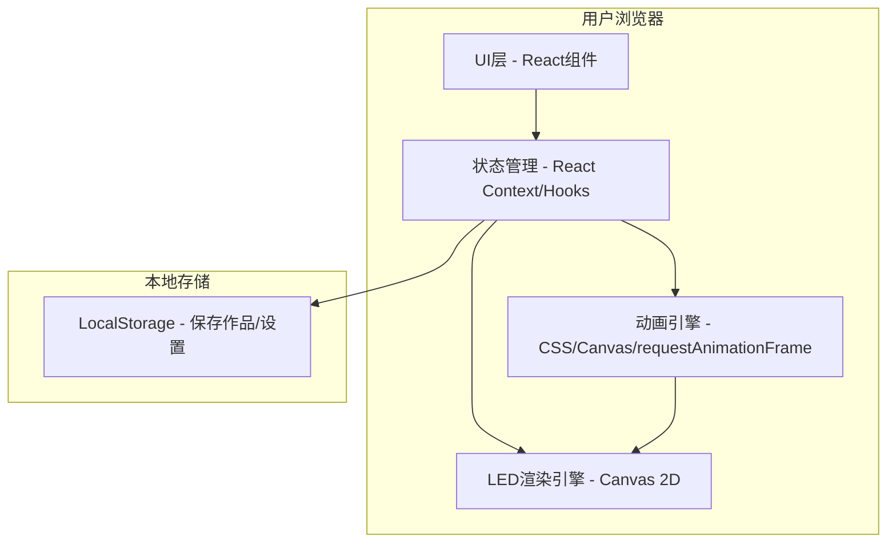

# LED Banner Tool 技术架构文档

## 1. 架构设计
采用纯前端静态网页架构，无需后端服务，所有数据本地存储，构建产物可直接部署到任意静态托管服务。



## 2. 技术说明
- **前端框架**：React 18 + TypeScript
- **构建工具**：Vite 5（快速构建、热更新）
- **样式方案**：Tailwind CSS 3 + CSS-in-JS动画
- **LED渲染**：Canvas 2D API（高性能绘制点阵LED效果）
- **动画系统**：requestAnimationFrame + CSS Animation
- **字体加载**：Google Fonts（Orbitron、Inter及多种展示字体）
- **状态管理**：React useReducer + Context API
- **部署方式**：静态构建产物，可部署到GitHub Pages、Vercel、Netlify等

## 3. 项目结构
```
led-banner-tool/
├── index.html
├── package.json
├── vite.config.ts
├── tsconfig.json
├── tailwind.config.js
├── postcss.config.js
├── public/
│   └── favicon.ico
└── src/
    ├── main.tsx
    ├── App.tsx
    ├── index.css
    ├── types/
    │   └── index.ts
    ├── contexts/
    │   └── LEDContext.tsx
    ├── hooks/
    │   ├── useLEDRender.ts
    │   └── useAnimation.ts
    ├── components/
    │   ├── Preview/
    │   │   ├── LEDPreview.tsx
    │   │   └── FullscreenPlayer.tsx
    │   ├── Panels/
    │   │   ├── TextPanel.tsx
    │   │   ├── BackgroundPanel.tsx
    │   │   ├── ControlPanel.tsx
    │   │   └── EffectPanel.tsx
    │   ├── UI/
    │   │   ├── TabBar.tsx
    │   │   ├── ColorPicker.tsx
    │   │   ├── Slider.tsx
    │   │   ├── Toggle.tsx
    │   │   └── ButtonGrid.tsx
    │   └── Navbar.tsx
    └── utils/
        ├── ledRenderer.ts
        ├── fonts.ts
        └── borders.ts
```

## 4. 核心数据模型

### 4.1 LED配置状态
```typescript
interface LEDConfig {
  text: string;
  font: string;
  fontSize: number;
  textColor: string;
  bold: boolean;
  italic: boolean;
  outline: boolean;
  outlineColor: string;
  shadow: boolean;
  shadowColor: string;
  textAlign: 'left' | 'center' | 'right';
  
  backgroundColor: string;
  ledDotEffect: boolean;
  ledDotSize: number;
  brightness: number;
  backgroundImage: string | null;
  
  scrollDirection: 'left' | 'right' | 'up' | 'down' | 'static';
  scrollSpeed: number;
  blink: boolean;
  blinkSpeed: number;
  
  borderStyle: string;
  borderColor: string;
  glowEffect: boolean;
}
```

### 4.2 预设模板
```typescript
interface Template {
  id: string;
  name: string;
  config: Partial&lt;LEDConfig&gt;;
  thumbnail: string;
}
```

## 5. 关键技术方案

### 5.1 LED点阵渲染
- 使用Canvas 2D绘制LED点阵网格
- 先在离屏Canvas渲染文字，再取样像素转换为LED点阵
- 通过globalCompositeOperation实现发光效果
- 根据亮度参数调整每个点的透明度和颜色

### 5.2 滚动动画
- 使用requestAnimationFrame实现60fps平滑滚动
- 根据scrollSpeed参数控制像素移动速度
- 文字移出边界后循环到另一侧实现无限滚动
- 支持四个方向滚动及静止模式

### 5.3 霓虹边框效果
- 使用CSS box-shadow多层叠加实现霓虹发光
- 预设多种边框样式：线性边框、虚线边框、装饰角、波形边框
- 边框颜色可自定义，支持呼吸动画效果

### 5.4 响应式适配
- 使用Tailwind响应式断点：sm(640px)/md(768px)/lg(1024px)/xl(1280px)
- 桌面端(lg+)：左右分栏布局，预览50% + 编辑50%
- 平板/手机：上下布局，预览自适应高度，编辑区可滚动
- 全屏播放使用Fullscreen API，自动锁定屏幕方向（可选）
